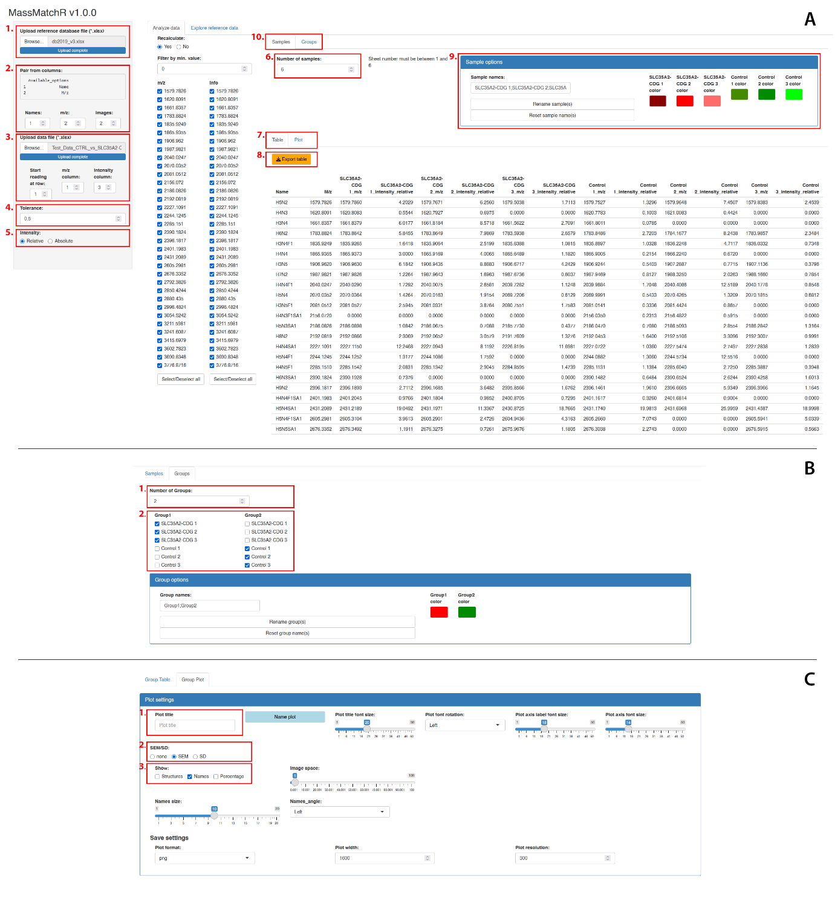

# MassMatchR

**MassMatchR** is an R/Shiny application for matching MALDI‑TOF MS peak lists (m/z + intensity) to a user‑provided reference glycan database, and for visualizing and exporting the matched results across **samples** and **groups**.

It is designed to be:
- **Fast and interactive** (reactive table + Plotly bar plots)
- **Flexible about input formats** (you select which columns to use for matching)
- **Reproducible and shareable** (hosted Shiny instance and a fully local version)

<p align="center">
  
</p>

## Where to use it

### Hosted (online) instance
As described in the accompanying manuscript, MassMatchR has been hosted at:

- http://dublin.embnet.sk:3838/massMatchR/

If the server is unavailable, you can run the same app locally (see below).

### Source code
This repository contains the Shiny app source code (`ui.R`, `server.R`, `global.R`, `run.R`) and full documentation.

## Quick start (local)

```r
# 1) Install required packages (see scripts/install_packages.R)
source("scripts/install_packages.R")

# 2) Run the app from the repository root
setwd("path/to/massMatchR_repo")
shiny::runApp(port = 8100)
```

More detailed instructions (including browser configuration and folder structure):
- **Local installation & run guide:** `docs/LOCAL_INSTALL.md`

## What you need to upload

MassMatchR works with two Excel workbooks:

1. **Reference database (.xlsx)**  
   A *single-sheet* Excel file with (at minimum):
   - a **Name** column (glycan/annotation label)
   - an **m/z** column (theoretical mass to match against)
   - optionally an **Image ID** column (numeric IDs used to pick PNG structures)

2. **Sample data (.xlsx)**  
   A *multi-sheet* Excel file where:
   - **each sheet = one sample**
   - each sheet contains at least **m/z** and **Intensity** columns
   - all sheets should follow the **same column layout**

Full details, examples, and file templates:
- **User manual:** `docs/MANUAL.md`
- **Example input files:** `example_data/`

## Citation

If you use MassMatchR in academic work, please cite the manuscript and/or this repository.
A machine‑readable citation file is included: `CITATION.cff`.

## License

A default MIT license is included in `LICENSE`.  
If you need a different license (e.g., GPL‑3), replace the file before publishing.

---
**Version in UI:** MassMatchR v1.0.0 (see app title bar)
